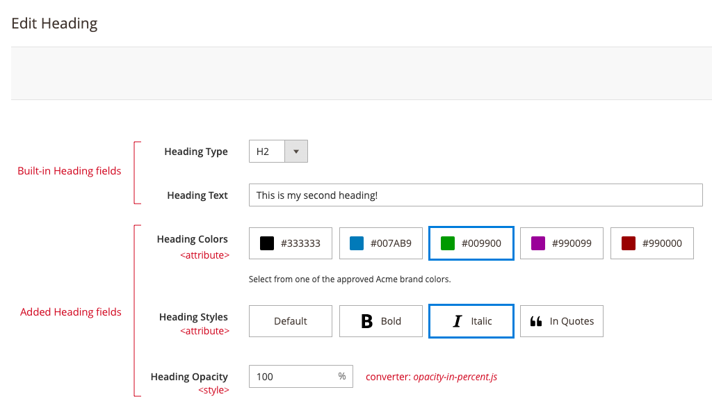

# Magento Page Builder - Configurations for Styling

This module extends the Heading content type to provide three new Heading fields: `Heading Colors`, `Heading Styles`, and `Heading Opacity`, as shown here:



The `Heading Colors` and `Heading Styles` options are added using two new `<attribute>` configurations to the `heading.xml` config file. Using `<attribute>` nodes gives you the option of apply attribute-based CSS classes to a content type's element:

```xml
<attribute name="heading_color" source="data-heading-color"/>
<attribute name="heading_style" source="data-heading-style"/>
```

The `Heading Opacity` option is added using one new `<style>` configuration to the `heading.xml` config file. Using a `<style>` node gives users control over a specific CSS property. In this example, we show how you can add a field to control the opacity of the Heading text by defining a `<style>` configuration:

```xml
<style name="heading_opacity" source="opacity" converter="Vendor_PageBuilderStylingWithAttributes/js/converter/style/opacity-in-percent"/>
```

And finally, as shown in the `<style>` configuration, we created a simple converter (`opacity-in-percent.js`) for the opacity property. This converter allows users to enter the opacity as percentage (0 - 100) that is converted to a decimal value when applied to the DOM.


## Installation and usage

To install this module:

1. Copy or clone the `PageBuilderStylingOptions` repo into a Magento instance directory named `Vendor` in the following location: `<magento-root>/app/code/Vendor`.
2. Command line into your `<magento-root>` directory and run `bin/magento setup:upgrade` to install the Heading extension module.
3. Navigate to a CMS Page and drag a Heading onto the stage.
4. Open the Heading's editor and view the additional `Heading Colors` and `Heading Styles` fields. These new fields add additional CSS styles to the the Heading content type using the custom attributes added to the `heading.xml` configuration file.

## Feedback

We encourage and welcome you to help us keep these examples current by submitting pull requests and issues. 
We also welcome your feedback and ideas on other code examples you would like to see added to this repo. 

## Slack
You can join our [#pagebuilder channel](https://magentocommeng.slack.com/messages/CHB455HPF), within [magentocommeng.slack.com](https://magentocommeng.slack.com/), to post your questions to the Page Builder community.

